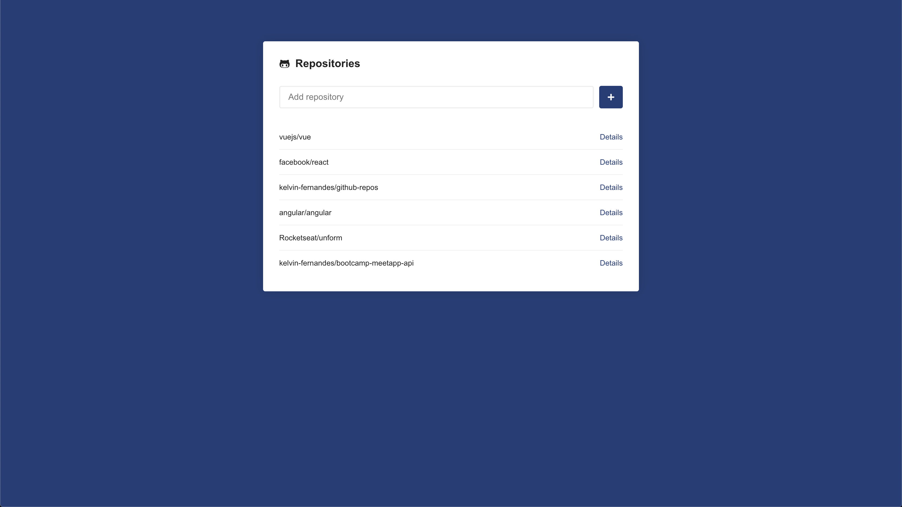
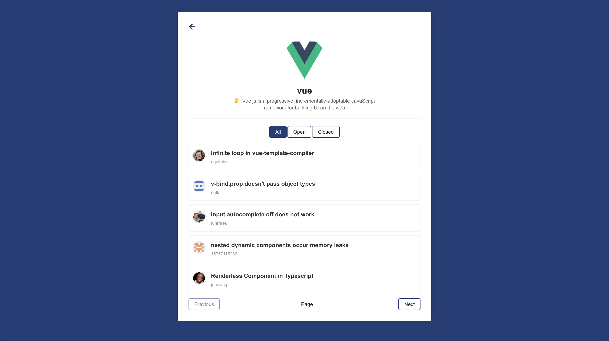

[![LinkedIn][linkedin-shield]][linkedin-url]

<p align="center">
  <h3 align="center">Github Repositories</h3>

  <p align="center">
    Project made with React, using Github API to show repositories and their issues.
    <br />
  </p>
</p>

## Table of Contents

-   [About the Project](#about-the-project)
    -   [Built With](#built-with)
-   [Getting Started](#getting-started)
    -   [Prerequisites](#prerequisites)
    -   [Installation](#installation)
-   [Usage](#usage)
-   [Contact](#contact)
-   [Acknowledgements](#acknowledgements)

## About The Project





At Home page there is a repositories list and an input where it's possible to add a new one. After adding a new repository, you can go to his details page, where it's showed up the repo issues: all, open and closed ones.

### Built With

-   [React](https://reactjs.org)

## Getting Started

So, to get this project alive:

### Prerequisites

-   [yarn](https://yarnpkg.com/en/docs/install)

### Installation

1. Clone the repo

```sh
$ git clone https://github.com/kelvin-fernandes/github-repos.git
```

2. install all application dependencies.

```sh
$ yarn
```

## Usage

And finally.

```
$ yarn start
```

## Contact

Kelvin Fernandes - [@i4kelvin](https://instagram.com/i4mkelvin) - sokelvinfernandes@gmail.com

Project Link: [https://github.com/kelvin-fernandes/github-repos](https://github.com/kelvin-fernandes/github-repos)

## Acknowledgements

-   [Axios](github.com/axios/axios/) - Promise based HTTP client
-   [Prop Types](https://github.com/facebook/prop-types) - Runtime type checking for React props and similar objects
-   [React Icons](https://github.com/react-icons/react-icons) - svg react icons of popular icon packs
-   [React Router DOM](https://github.com/ReactTraining/react-router) - Declarative routing for React
-   [Styled Components](https://github.com/styled-components/styled-components) - Visual primitives for the component age
-   [ESLint](eslint.org) - Linting utility for JavaScript
-   [Prettier](prettier.io) - Code formatter

[linkedin-shield]: https://img.shields.io/badge/-LinkedIn-black.svg?style=flat-square&logo=linkedin&colorB=1178B3
[linkedin-url]: https://linkedin.com/in/kelvin-fernandes
